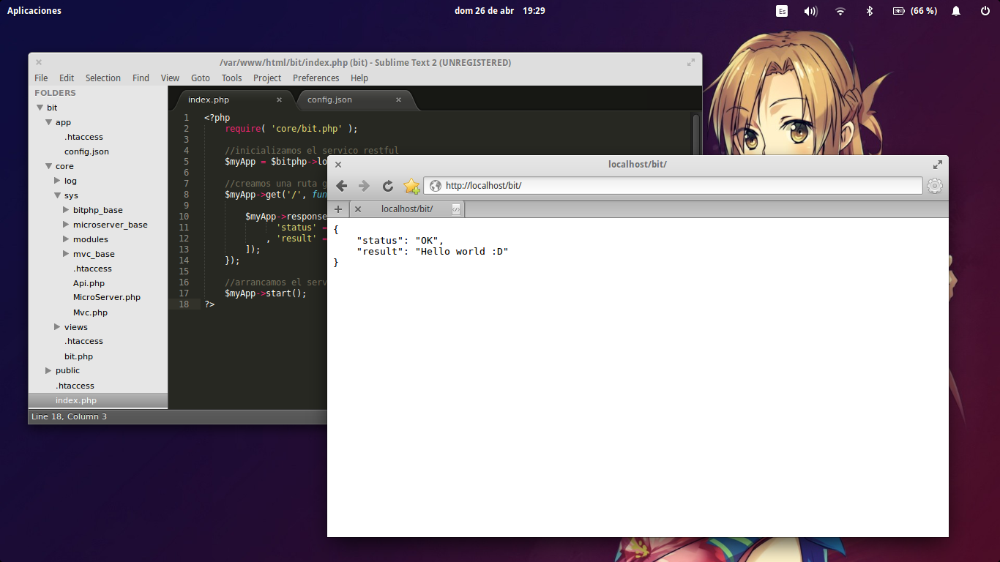

.. _install:

Instalación
===========

Ya sea qué trabajes con windows o con alguna distro linux lo primero qué debes hacer es descargar bitphp, para ello puedes visitar la `sección de descargas <http://bitphp.root404.com/downloads>`_ en donde puedes encontrar varias versiones, procura descargar la ultima, también podrás encontrar varias aplicaciones de ejemplo pero esas las veremos más tarde.

Requisitos
~~~~~~~~~~

- Servidor Apache con mod rewrite activado
- PHP versión 5.4 o superior.
- Servidor SQL ( recomendamos MySQL Server )

Puedes leer las :ref:`notes` si no conoces o no tienes experiencia instalando/configurando alguno de los requisitos. Una vez qué tengas listos todos los requisitos y hayas descargado bitphp puedes proceder según tu sistema operativo:

Linux
~~~~~

Cuando descargues bitphp tendrás en tus manos un comprimido con todos los archivos fuente de bitphp, debemos descomprimir dicho archivo en la carpeta publica del servidor ( en donde se deben poner los archivos html, php, etc. ) dicha carpeta en linux normalmente es **/var/www/** o **/var/www/html/** en algunos casos.

BitPHP puede trabajar sin problemas en una sub-carpeta, por ejemplo; puedes tener dentro de **/var/www/mvc** una instancia de bitphp trabajando con mvc y en **/var/www/api** una instancia de bitphp trabajando con una aplicación restful. Crearemos una carpeta llamda *bit* dentro de la cual tendrás qué descomprimir los ficheros de bitphp, quedando la estructura de directorios de la siguiente manera:

.. code::

   ├── var/
       └── www/
           └── bit/
               ├── app/
               ├── core/
               ├── public/
               ├── .htaccess
               └── index.php

.. image:: images/img-installation-1.png

Ahora si abrimos algún navegador y nos dirigimos a la dirección **http://localhost/bit/** podemos apreciar un mensaje de error de bitphp qué nos indica que no se ha encontrado ningún archivo de configuración, pero, a pesar de qué es un error, no es malo, al contrario ¡es señal de que bitphp esta trabajando correctamente!

.. _img-2:

*Fig. 1 Instalación de bitphp en blanco*
----------------------------------------

.. image:: images/img-installation-2.png

En cuanto a la instalación de bitphp es prácticamente todo, puedes ver el :ref:`tuto-1` para configurar bitphp según el tipo de aplicación qué quieres desarrollar.

Windows
~~~~~~~

Una vez qué hayas descargado bitphp, dirigete a la carpeta de tu servidor **C:/xampp/htdocs/** normalmente en Windows con xampp. Debes crear una carpeta llamada **bit** en donde vas a descomprimir los archivos de bitphp, con lo que tendrás una estructura de directorios como la siguiente:

.. code::

   ├── xampp/
       └── htdocs/
           └── bit/
               ├── app/
               ├── core/
               ├── public/
               ├── .htaccess
               └── index.php

.. image:: images/img-installation-3.png

Ahora si abrimos algún navegador y nos dirigimos a la dirección **http://localhost/bit/** podemos apreciar un mensaje de error de bitphp qué nos indica que no se ha encontrado ningún archivo de configuración, pero, a pesar de qué es un error, no es malo, al contrario ¡es señal de que bitphp esta trabajando correctamente!

.. image:: images/img-installation-4.png

.. _config-file:

El archivo de configuración.
============================

En una instalación en blanco de bitphp (ver :ref:`install`) al acceder desde el navegador podemos observar un mensaje de error el cual nos dice qué falta el archivo de configuración (ver :ref:`img-2`).

Este mensaje aparece ya qué no existe el archivo **config.json**, pero independientemente de si existe o no, podemos mostrar dicho mensaje para poder crear o modificar los parámetros de configuración de la siguiente manera; Dentro del **index.php** escribimos lo siguiente: 

.. code-block:: php

   <?php  
      require( 'core/bit.php' );
      $bitphp->configMaker();
   ?>

Y al dirigirte a **http://localhost/bit** ( o la dirección donde se encuentre tu instalación de bitphp ) podrás ver el mensaje de error en dondé puedes crear los archivos de configuración. Para crear un archivo de configuración desde el mensaje de error da click en el botón **crear archivo de configuración** y se desplegara un formulario el cual nos pide llenar ciertos parámetros:

+----------------------------+------------------------------------+---------------------------------+--------------------------+
|          Parametro         |            Descripcion             | Necesario para (o soportado):   | Valor                    |
+----------------------------+------------------------------------+-----------+---------+-----------+--------------------------+
|                            |                                    | MVC/HMVC  | RestFUL | Micro MVC |                          |
+============================+====================================+===========+=========+===========+==========================+
| Ambiente de la aplicación  | Determina si la aplicación usará   | SI        | SI      | SI        |  develop/production      |
|                            | la configuración para un ambiente  |           |         |           |  - *develop* por         |
|                            | de desarrollo o un ambiente de     |           |         |           |  defecto                 |
|                            | producción                         |           |         |           |                          |
+----------------------------+------------------------------------+-----------+---------+-----------+--------------------------+
| Activar HMVC               | Indica si la aplicación trabaja    | SI        | NO      | NO        | true/false - *false*     |
|                            | con MVC o HMVC                     |           |         |           | por defecto              |
+----------------------------+------------------------------------+-----------+---------+-----------+--------------------------+
| Aplicación predeterminda   | Podemos decir qué es la aplicación | SI (HMVC) | NO      | NO        | <nombre_de_la_app>       |
|                            | *index* cuando trabajas con HMVC   |           |         |           | - *null* por defecto     |
+----------------------------+------------------------------------+-----------+---------+-----------+--------------------------+
| Controlador predeterminado | Controlador *index* de la          | SI        | NO      | NO        | <nombre_del_controlador> |
|                            | aplicación                         |           |         |           | - *home* por defecto     |
+----------------------------+------------------------------------+-----------+---------+-----------+--------------------------+
| Acción predeterminada      | Acción *index* del controlador     | SI        | NO      | NO        | <nombre_de_la_acción>    |
|                            |                                    |           |         |           | - *main* por defecto     |
+----------------------------+------------------------------------+-----------+---------+-----------+--------------------------+
| Modulos auto-cargados      | Modulos que se cargarán al         | SI        | NO      | NO        | Nombres de los mudulos   |
|                            | controlador automaticamente        |           |         |           | separados por comas -    |
|                            |                                    |           |         |           | *null* por defecto       |
+----------------------------+------------------------------------+-----------+---------+-----------+--------------------------+
| Directorio base            | Directorio en el cual se encuentra | SI        | SI      | SI        | <directorio> - */*       |
|                            | la instalación de bitphp           |           |         |           | (raiz) por defecto       |
+----------------------------+------------------------------------+-----------+---------+-----------+--------------------------+
| Debug (mostrar errores)    | Determina si se deben mostrar      | SI        | NO      | NO        | true/false - *true* por  |
|                            | detalles de los errores de la      |           |         |           | defecto para *develop* y |
|                            | aplicación                         |           |         |           | *false* por defecto para |
|                            |                                    |           |         |           | *production*             |
+----------------------------+------------------------------------+-----------+---------+-----------+--------------------------+
| Host para la base de datos | Host al qué se va a conectar por   | SI        | SI      | SI        | <host> - *localhost* por |
|                            | defecto la base de datos           |           |         |           | defecto                  |
+----------------------------+------------------------------------+-----------+---------+-----------+--------------------------+
| Usuario para la base de    | Usuario predeterminado qué será    | SI        | SI      | SI        | <user> - *root* pos      |
| datos                      | usado para conectar con la base de |           |         |           | detecto                  |
|                            | datos                              |           |         |           |                          |
+----------------------------+------------------------------------+-----------+---------+-----------+--------------------------+
| Contraseña para la base de | Contraseña predeterminada para la  | SI        | SI      | SI        | <pass> - *null* por      |
| datos                      | base de datos                      |           |         |           | defecto                  |
+----------------------------+------------------------------------+-----------+---------+-----------+--------------------------+
| Driver para la base de     | Driver predeterminado para la      | SI        | SI      | SI        | <driver> - *mysql* por   |
| datos                      | a la base de datos                 |           |         |           | por defecto              |
+----------------------------+------------------------------------+-----------+---------+-----------+--------------------------+
| Charset para la base de    | Charset por defecto para conectar  | SI        | SI      | SI        | <charset> - *utf8* por   |
| datos                      | a la base de datos                 |           |         |           | defecto                  |
+----------------------------+------------------------------------+-----------+---------+-----------+--------------------------+

Pero podrás notar qué algunos parámetros se repiten, esto debido a qué unos son para el entorno de desarrollo y otros para el entrono de producción, tambien notarás que hay un apartado **Alias para nombres de bases de datos** puedes leer más de ello en `Alias para bases de datos <mvc-models.html#alias-para-las-bases-de-datos>`_.

Quizá deberías ver: `Entornos de desarrollo <faqs.html#faq-2>`_ · `¿Qué es el index? <faqs.html#faq-1>`_

.. _tuto-1:

Tutorial 1: Hello world
=======================

Este tutorial abarca el desarrollo de un simple hola mundo en los diferentes tipos de servicios que se puedes crear con bitphp; **MVC/HMVC**, **Micro MVC** y **REstFUL**, se desarrolla en un entorno con:

- Computador portátil Samsung Core i3, 4Gb RAM
- Sistema Operativo ElementaryOS Freya
- Apache 0.91-ubuntu1
- PHP 5.4

Saltar a:
~~~~~~~~~

* `Hello world: MVC Application <#mvc-application>`_
* `Hello world: HMVC Application <#hmvc-application>`_
* `Hello world: Micro MVC Application <#micro-mvc-application>`_
* `Hello world: RESTful Application <#restful-application>`_

MVC Application
~~~~~~~~~~~~~~~

Vamos a retomar la instalación que ya tenías (ver :ref:`install`), lo primero qué hay qué hacer es crear el archivo de configuración, para ello vamos a ir al error qué nos arroja bitphp y donde podemos crear el archivo de configuración fácilmente (ver :ref:`config-file`), solo llenamos los siguientes campos:

- **Ambiente de la aplicación:** *develop*
- **Activar HMVC:** *false*
- **Directorio base (para develop)**: */bit* (si es qué tu instalación esta en el sub-directorio *bit* como la de nosotros)

Todos los demás por ahora los puedes dejar en blanco, ahora solo pulsa en el botón **Generar y descargar** qué se encuentra en la parte inferior, con esto descargaras un archivo *config.json* dicho archivo deberás guardarlo en la carpeta **/app** de tu instalación, de igual manera hay qué crear algunos directorios (*controllers/*, *views/*, *models/*) dentro de la carpeta **app/** quedando una estructura de directorios de la siguiente manera:

.. code::

   ├── var/
       └── www/
           └── bit/
               ├── app/
               │   ├── models/
               │   ├── views/
               │   ├── controllers/
               │   ├── .htaccess
               │   └── config.json
               ├── core/
               ├── public/
               ├── .htaccess
               └── index.php

Por cuestiones de seguridad **es importante** qué mantengas el archivo **.htaccess** dentro de la carpeta *app/* para evitar qué el usuario (o personas mal intencionadas) tengan acceso a información de la aplicación.

Creando un controlador.
-----------------------

Crea un archivo llamado **hola.php** dentro de la carpeta **app/controllers/** con el siguiente contenido:

.. code-block:: php

   <?php  # app/controllers/hola.php
   		
       class Hola {
          public function main() {
             echo "Hola mundo!";
          }
       }
   ?>

Inicializando la aplicación.
----------------------------

Para ello debemos ir al archivo **index.php** e iniciar la aplicación de la siguiente manera:

.. code-block:: php

   <?php
       require( 'core/bit.php' );
       $myApp = $bitphp->loadMvcServer();
       $myApp->run();
   ?>

Probando la aplicación
----------------------

Ahora solo dirígete a **http://localhost/bit/hola** en cualquier navegador y observa los resultados:

.. _img-tuto-1:

.. image:: images/img-tuto-1-1.png

HMVC Application
~~~~~~~~~~~~~~~~

Nuevamente tomando la instalación que ya tenías (ver :ref:`install`) vamos a desarrollar un simple ejemplo de una aplicación HMVC. Primero creamos el archivo de configuración desde el error qué nos arroja bitphp (ver :ref:`config-file`) llenando los siguiente campos:

- **Ambiente de la aplicación:** *develop*
- **Activar HMVC:** *true*
- **Aplicación predeterminada:** *myApp1*
- **Directorio base (para develop)**: */bit* (si es qué tu instalación esta en el sub-directorio *bit* como la de nosotros)

Da click en **Generar y descargar** y lo guardas en la carpeta **app/**. Ahora debes crear la estructura de directorios para la aplicación, dentro de la carpeta **app/** debes crear un directorio llamado **myApp1/** qué a su vez tendrá los directorios **controllers/**, **views/** y **models/** con lo cual la estructura de directorios quedara de la siguiente manera:

.. code::

   ├── var/
       └── www/
           └── bit/
               ├── app/
               │   ├── myApp1/
               │   │   ├── controllers/
               │   │   ├── views/
               │   │   └── models/
               │   ├── .htaccess
               │   └── config.json
               ├── core/
               ├── public/
               ├── .htaccess
               └── index.php

Creando el controlador
----------------------

Hay qué crear un controlador para **myApp1** para ello crea un archivo llamado **hola.php** en el directorio **app/myApp1/controllers/** con el siguiente contenido:

.. code-block:: php

   <?php # app/myApp1/controllers/hola.php
      class Hola {
         public function main() {
            echo "Hola, soy la app1";
         }
      }
   ?>

Inicializando el servicio HMVC
------------------------------

Exactamente como un servicio MVC debemos ir al archivo **index.php** e iniciar la aplicación de la siguiente manera:

.. code-block:: php

   <?php
       require( 'core/bit.php' );
       $myApp = $bitphp->loadMvcServer();
       $myApp->run();
   ?>

Probando la aplicación
----------------------

Ahora prueba las siguientes direcciones y observa los resultados.:

- http://localhost/bit/myApp1/hola

Micro MVC Application
~~~~~~~~~~~~~~~~~~~~~

El crear un hola mundo con un servicio Micro MVC de bitphp es aún mas fácil, retomando nueva mente la instalación que ya debes tener (ver :ref:`install`) creamos un archivo de configuración (ver :ref:`config-file`) y lo guardamos en la carpeta **app/**, llenas solamente los siguientes campos: 

- **Ambiente de la aplicación**: develop
- **Directorio base (para develop)**: */bit* (si es qué tu instalación esta en el sub-directorio *bit* como la de nosotros)

Ahora hay qué editar el archivo **index.php** con el siguiente contenido:

.. code-block:: php

   <?php
      require( 'core/bit.php' );

      //inicializamos el servico micro mvc
      $myApp = $bitphp->loadMicroServer();

      //creamos una ruta para la raiz
      $myApp->route('/', function() use ( $myApp ){
         echo "Hola mundo :D!";
      });

      //arrancamos el servicio de micro-serving
      $myApp->run();
   ?>

Hecho esto, si te diriges a tu navegador a la dirección http://localhost/bit/ podrás ver los resultados:

.. image:: images/img-tuto-1-2.png

RESTful Application
~~~~~~~~~~~~~~~~~~~

El hacer un hola mundo con el servicio de RESTful de bitphp es igual de fácil, para crear el archivo de configuración es igual que en la `aplicación micro mvc <#micro-mvc-application>`_ la diferencia radica en el **index.php** el cual debe tener lo siguiente:

.. code-block:: php

   <?php
      require( 'core/bit.php' );

      //inicializamos el servico restful
      $myApp = $bitphp->loadApiServer();

      //creamos una ruta get para la raiz
      $myApp->get('/', function() use ( $myApp ){
      
         $myApp->response([
              'status' => $myApp->getStatusMessage()
            , 'result' => 'Hello world :D'
         ]);
      });

      //arrancamos el servicio restful
      $myApp->start();
   ?>

Ahora si te diriges a la dirreción http://localhost/bit/ podrás ver el resultado:

.. _notes:

Notas de instalación
====================

.. toctree::
   :maxdepth: 2

   installation-notes